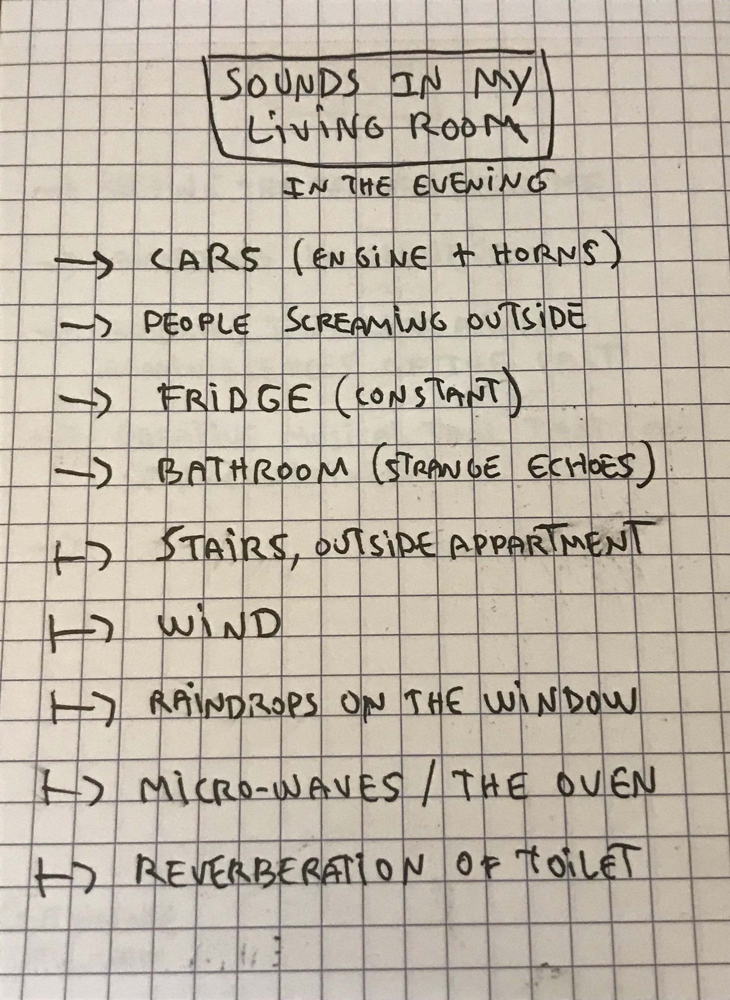
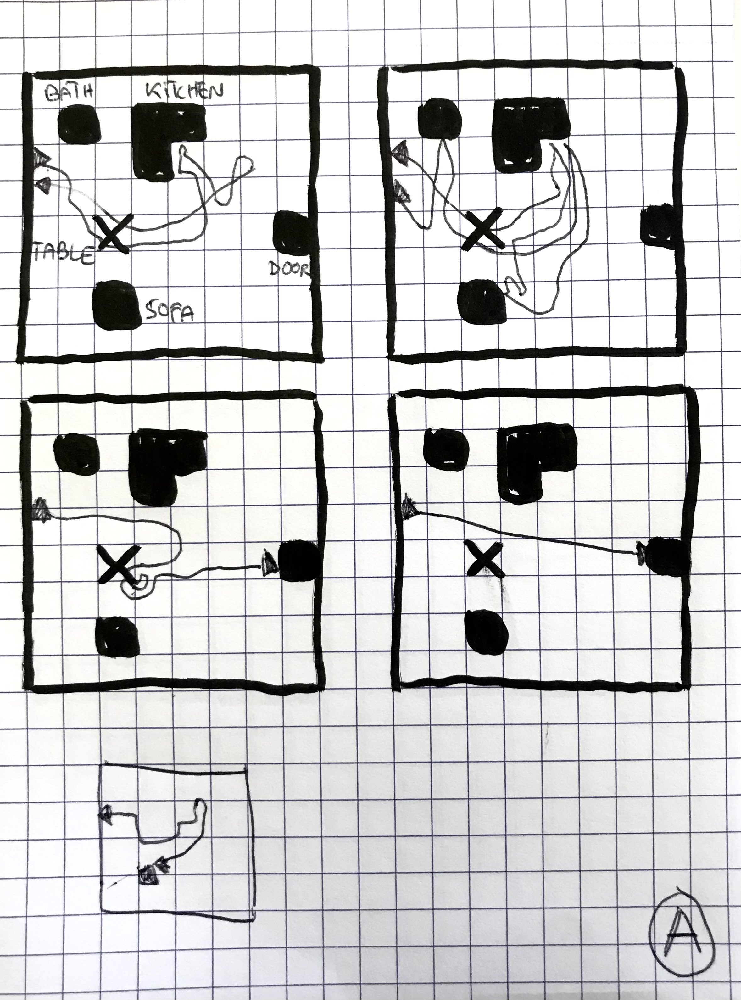
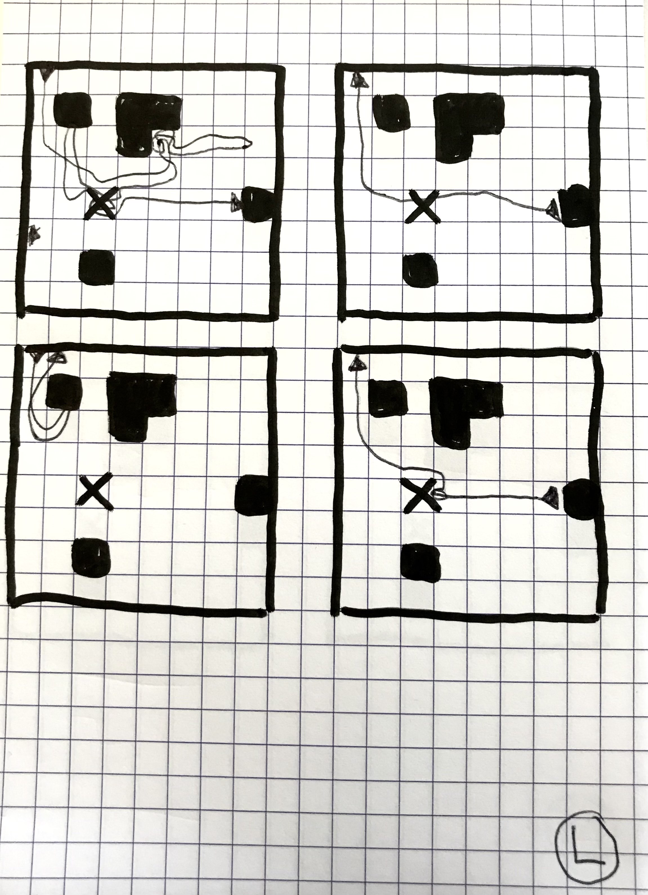
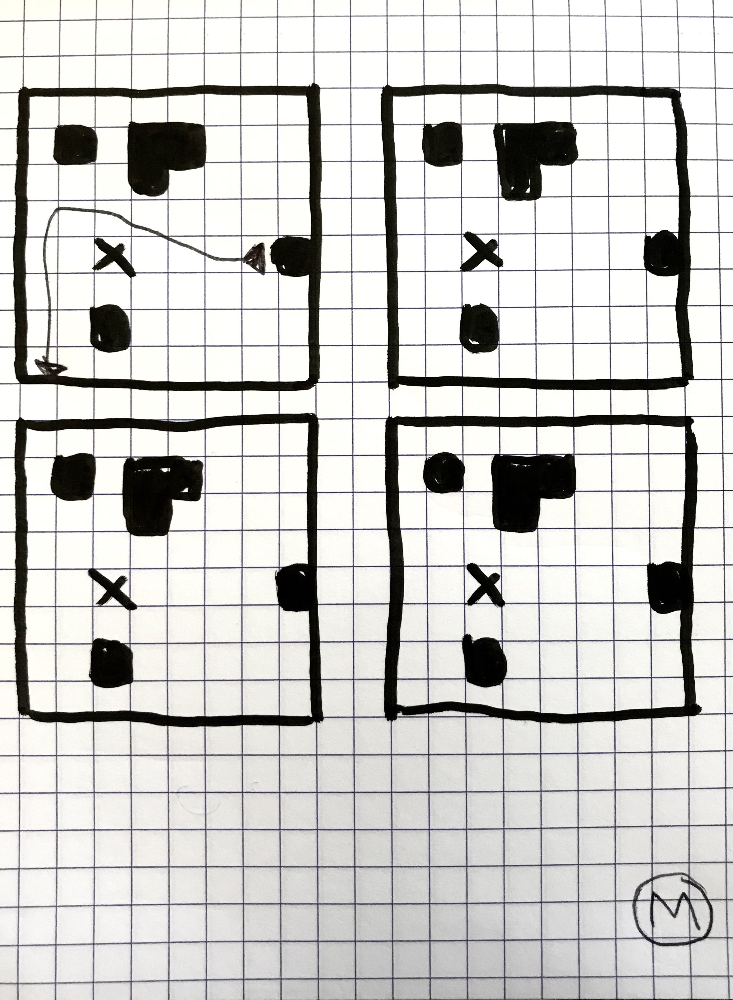
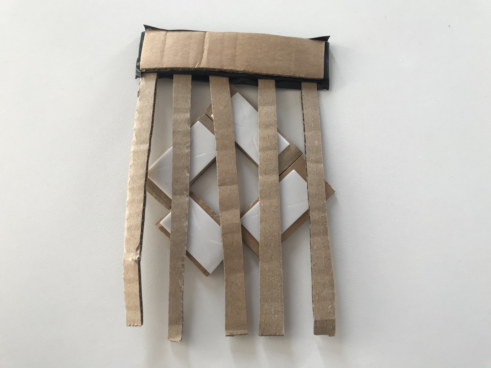
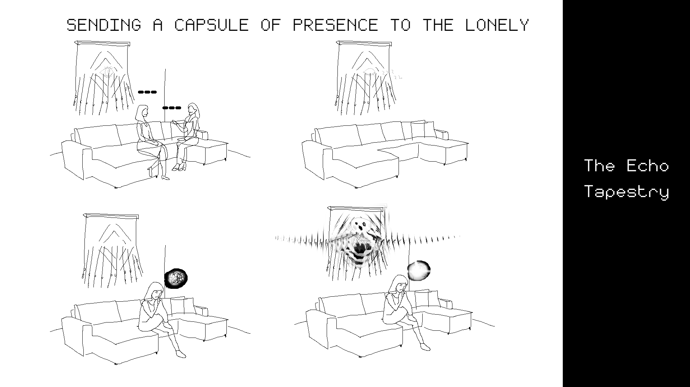
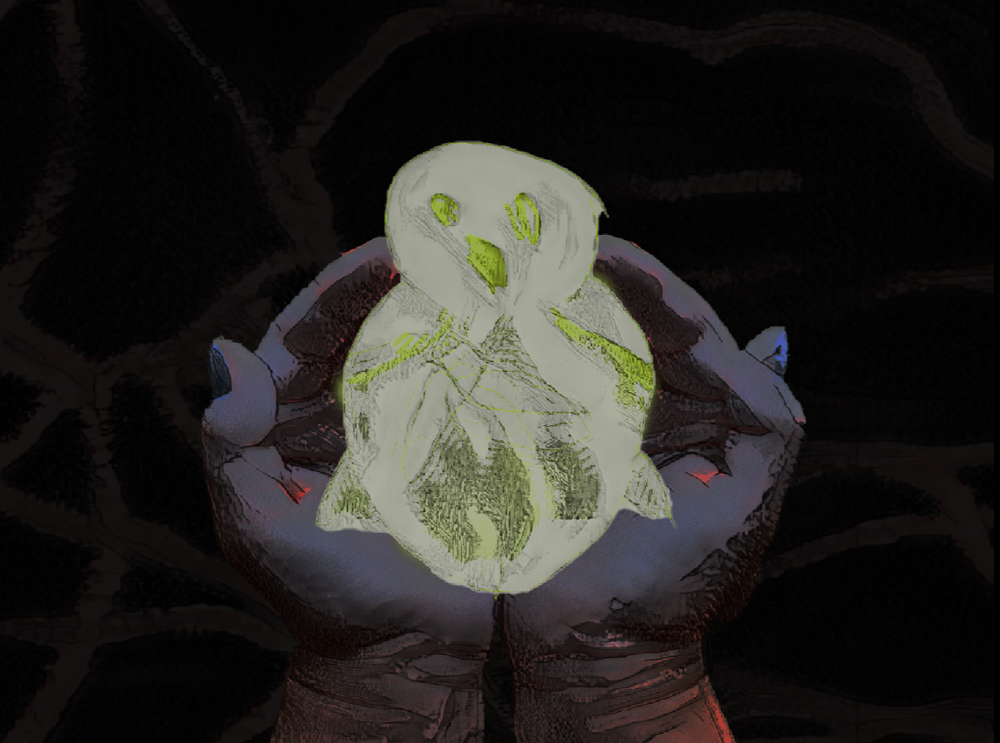
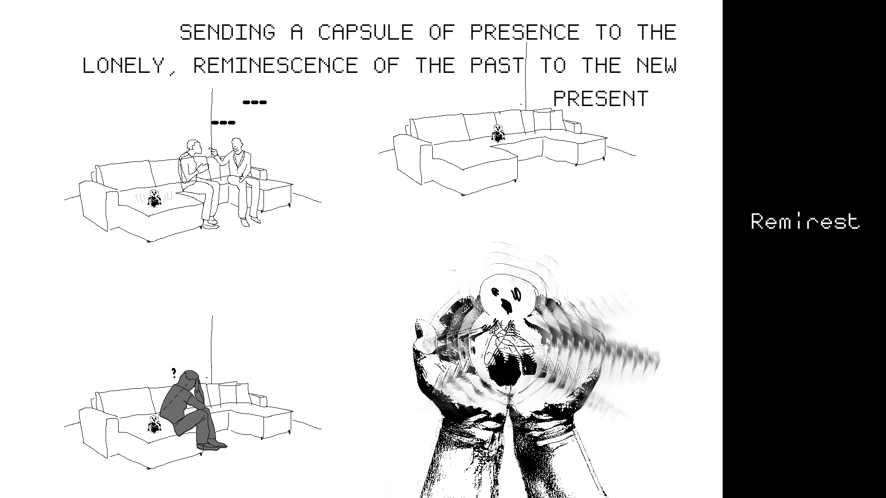

# Francesco Le Touzé
- Soft Robots
- Master Media Design + O2R

## Area of intervention

Ressurecting/invoking presences and reminescences in a domestic space.

## Research Question

How can people be less lonely at home ?
How can you turn memories to life again ? 
How to signal someone was at home few times ago ?
How to redefine the silence in the living room ? 

## Research
I focused my researchs around my living room, where my four roommates often circulate, to use the kitchen, relax on the sofa, eat on the table, and sometimes interact and talk with each other. I decided to note every sound that would occur around the room, from the loudest and most repetitive ones to the most unsignificant ones. 

I traced the steps of three of my roommates to see where they would often go in the space, trying to have a first impression of what would be their zones of interest in the room. Most of the time they wouldn't appear a lot, sometimes I missed them. 

## Insights
The kitchen 

## First ideas & prototypes
Being unable of interacting with my roommates as much as I wanted, I came with the desire of trying to capture their presence, completely or partially, in a poetic way.
The first days, I had the idea of a robot that would change of color for few hours when detecting someone and one that would spread attractive smells when someone come back home. For now, I decided to focus on one of my ideas that goes as follow "A robot generating very quiet pleasant sounds when nobody is talking for a while in the living room, these sounds being sampled and reshaped from conversations it heard few hours before." 

Later in my process, I fed ChatGPT with some movies and asket it to make associatons of ideas with my main concept. The movies were Altered States of Ken Russel, La Jetée of Chris Marker, Solaris of Tarkovski and Wall-E of Andrew Stanton.

### The Echo Tapestry
The Echo Tapestry is basically a tapestry that sleeps during quiet moments, but wake up when it hears human rumors around itself, it listens conversations then reshapes them into unrecognizing sounds, echoes, which it will then ressurect hours later when detecting a silent presence. 

#### Storyboard 1

### Remirest
Remirest is a smaller prototype than Echo Tapestry, it's a small companion that can be held in the palm of the hand or worn as a necklace, it has the same function of the first prototype but ressurect a reminescence when feeling the touch of a human. 

I made a very quick auditive prototype, testing how the sound would be generated with the data (see video)

#### Storyboard 2

## Next Steps
For the next steps, I am coming back to :
- Researchs, definitely exploring more the subject, developping my research questions.
- Defining a list of better scenarios -than my current one- for my robot and all the possibilities it could involve. 
- Work a few other physical prototypes. 